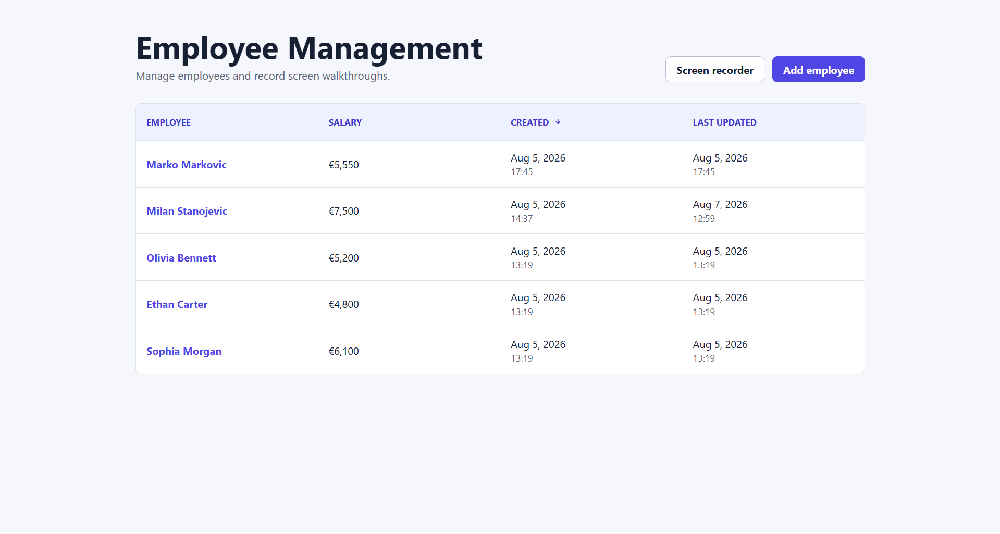
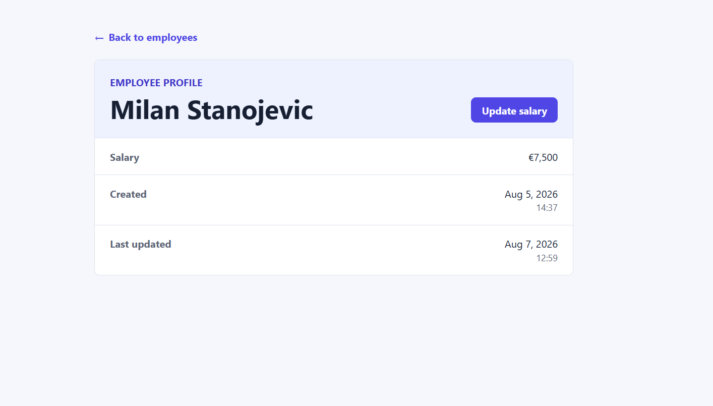
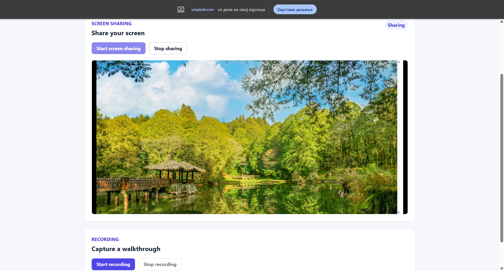

# Employee Management

Employee Management is a full-stack React and Express application for managing employee records and recording browser-based screen walkthroughs. It supports employee retrieval, creation, salary updates, client-side sorting, and native browser screen sharing and recording.

## Features

- Fetch all employees
- Fetch a single employee
- Create an employee
- Update employee salary
- Sort employees by Employee, Salary, Created, and Last updated
- Ascending and descending sorting
- Employee details routing
- Responsive desktop, tablet, and mobile UI
- Loading, empty, validation, not-found, and error states
- User-friendly retry/error handling when the API is unavailable
- Success feedback after employee creation and salary updates
- Native screen sharing
- Native screen recording
- Local recording preview
- WebM recording download

## Screenshots

### Employee Management



### Employee Details



### Screen Sharing and Recording



## Tech Stack

- React
- TypeScript
- Vite
- React Router
- Express
- Zod
- `node:sqlite`
- Native browser `MediaDevices`, `getDisplayMedia`, and `MediaRecorder` APIs

## Architecture

The frontend uses a feature-based organization under `src/features`. The employee feature is separated into API functions, components, hooks, pages, schemas, domain types, and utilities. Recording media lifecycle logic is isolated in its hook. Shared reusable components live under `src/components`, global route-level pages live under `src/pages`, and shared HTTP behavior lives in `src/lib/apiClient.ts`.

The backend is an Express API. The employee feature lives under `server/src/features/employees`, while a repository layer owns SQLite access. Zod validates request payloads and database rows where implemented, and SQLite statements use prepared statements with bound parameters.

## Project Structure

```text
docs/
`-- screenshots/
    |-- employee-details.png
    |-- employees.png
    `-- screen-recorder.png

src/
|-- components/
|   |-- BackToEmployeesLink.tsx
|   `-- Toast.tsx
|-- pages/
|   `-- NotFoundPage.tsx
|-- features/
|   |-- employees/
|   |   |-- api/
|   |   |-- components/
|   |   |-- hooks/
|   |   |-- pages/
|   |   |-- schemas/
|   |   |-- types/
|   |   `-- utils/
|   `-- recording/
|       |-- components/
|       |-- hooks/
|       `-- pages/
|-- lib/
|   `-- apiClient.ts
|-- App.tsx
|-- App.css
|-- index.css
`-- main.tsx

server/src/
|-- database/
|   |-- database.ts
|   `-- seed.ts
|-- features/
|   `-- employees/
|       |-- employee.repository.ts
|       |-- employee.routes.ts
|       |-- employee.schemas.ts
|       `-- employee.types.ts
|-- app.ts
`-- index.ts

public/
`-- favicon.svg
```

## Prerequisites

- Node.js 24.x recommended
- npm
- A modern browser with screen sharing and MediaRecorder support

## Getting Started

```bash
git clone https://github.com/milanNbg/employee-management-app.git
cd employee-management-app
npm install
npm run dev
```

`npm run dev` starts the Vite frontend and Express backend together.

- Application: `http://localhost:5173`
- Backend: `http://localhost:3001`

Frontend `/api` requests use the Vite development proxy to reach the backend.

## Available Scripts

- `npm run dev` - starts the Vite frontend and Express backend together.
- `npm run dev:client` - starts only the Vite frontend.
- `npm run dev:server` - starts only the Express backend in watch mode.
- `npm run lint` - runs ESLint.
- `npm run typecheck` - runs frontend and backend TypeScript checks.
- `npm run build` - runs typecheck and builds the frontend for production.
- `npm run preview` - previews the production frontend build.

## Application Routes

- `/` - redirects to `/employees`
- `/employees` - employee list, sorting, and creation flow
- `/employees/:employeeId` - employee details and salary update flow
- `/recording` - local screen sharing and recording tool
- Unmatched routes - global not-found page

## API Endpoints

- `GET /api/employees` - returns all employees
- `GET /api/employees/:id` - returns a single employee by ID
- `POST /api/employees` - creates an employee
- `PATCH /api/employees/:id/salary` - updates an employee salary

Example `POST /api/employees` body:

```json
{
  "firstName": "Olivia",
  "lastName": "Bennett",
  "salary": 5200
}
```

Example `PATCH /api/employees/:id/salary` body:

```json
{
  "salary": 6000
}
```

## Data Model

Employee API models use camelCase fields:

- `id`
- `firstName`
- `lastName`
- `salary`
- `createdAt`
- `updatedAt`

SQLite rows use snake_case internally and are mapped to camelCase API models. The backend owns UUID generation and timestamps.

## Employee Sorting

Employee sorting is client-side. The sortable fields are Employee, Salary, Created, and Last updated. The default order is Created descending.

Desktop users sort through table-header buttons. Mobile users sort through a compact sorting control above the employee cards. Sorting creates a derived list and does not mutate the source employee state.

## Screen Recording

Screen sharing uses `navigator.mediaDevices.getDisplayMedia`. Recording uses `MediaRecorder` to record the active display `MediaStream`.

The user must start screen sharing before recording. Webcam access is not requested. The live preview remains local to the browser, recordings are not uploaded to the backend, and completed recordings can be previewed and downloaded as WebM files.

Browser-native picker UI, permission prompts, and sharing controls are controlled by the browser. Stopping sharing through the browser-native UI is detected through display-track lifecycle handling.

## Assumptions and Technical Decisions

- Salary is displayed as EUR as an application-level assumption.
- UUID employee identifiers are generated by the backend.
- SQLite provides local persistence.
- Recordings intentionally remain browser-local.
- Native browser recording APIs were preferred over adding another dependency.
- No webcam access is requested.

## Manual Verification

The main user flows can be verified with the following scenarios:

| Scenario | Expected behavior |
| --- | --- |
| Load employees | Employee list loads from the API and is displayed with Created descending by default. |
| Sort employees | Employees can be sorted by Employee, Salary, Created, and Last updated in both directions without mutating source data. |
| Create employee | A valid employee is created, the list refreshes, the dialog closes, and success feedback is shown. |
| Invalid employee input | Validation feedback is displayed and invalid data is not submitted. |
| Open employee details | Selecting an employee navigates to the employee-specific details route. |
| Update salary | The updated salary and Last updated value are reflected on the employee details page and success feedback is shown. |
| API unavailable | A user-friendly error state is shown with a Retry action where appropriate. |
| Employee not found | An invalid employee ID displays the employee-specific not-found state. |
| Screen sharing | The browser display picker starts a live shared-screen preview after permission is granted. |
| Screen recording | Recording can start only while a display stream is actively shared. |
| Stop browser-native sharing | The application detects the ended display track, safely finalizes an active recording when necessary, and returns to the ready state. |
| Download recording | A completed recording can be previewed and downloaded as a WebM file. |

## Validation and Quality

The project uses:

- Strict TypeScript
- ESLint
- Zod validation
- Prepared SQLite statements
- Accessible semantic controls
- Keyboard and focus handling
- Responsive layouts
- Explicit loading, error, and not-found states

Run the final local quality checks with:

```bash
npm run lint
npm run typecheck
npm run build
```

## Browser Support

Screen sharing depends on `getDisplayMedia` support, recording depends on `MediaRecorder` support, and browser permission is required. Unsupported environments display the application's unsupported state.
